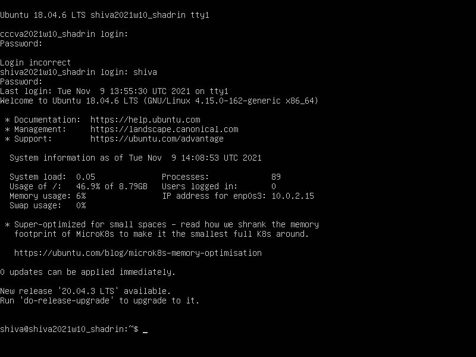
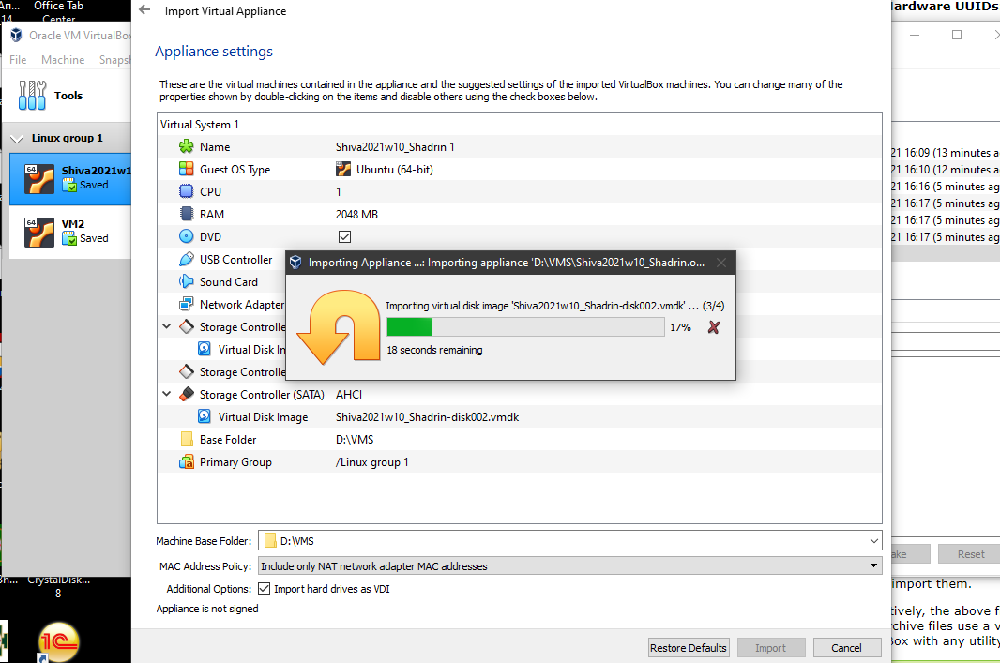
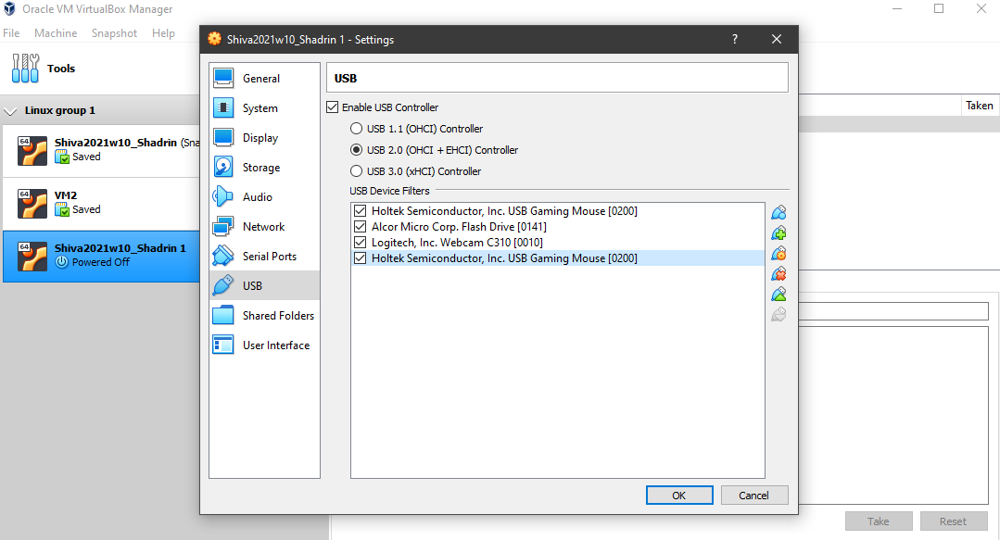
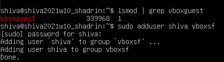
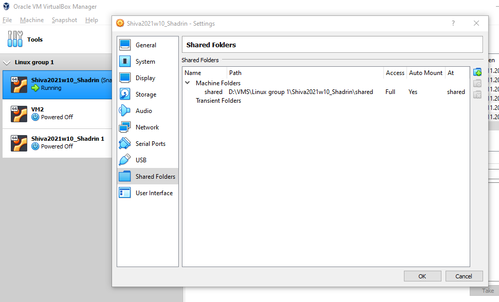
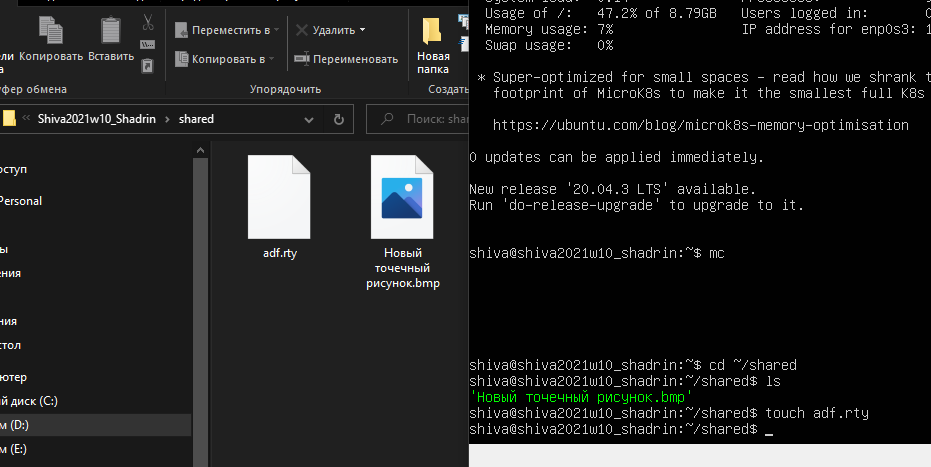
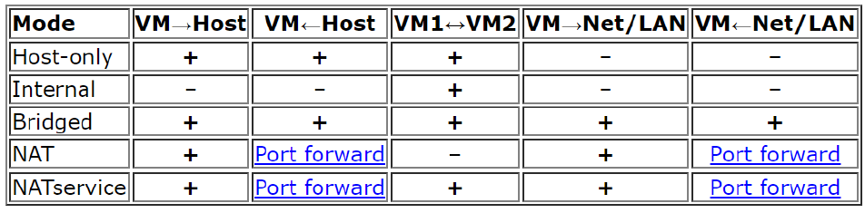

# TASK 2.1

## PART 1. HYPERVISORS

### 1.What are the most popular hypervisors for infrastructure virtualization?

* Xen
* Hyper-V
* VMware
* KVM (RHEV)

### 2.Briefly describe the main differences of the most popular hypervisors
Depending on the hypervisor, the capabilities provided by it can radically change, it is necessary to carefully consider the choice of the control basis of the virtual environment.
When comparing, the most important characteristics and capabilities of hypervisors are:

* ***scalability, infrastructure expansion***;

* ***performance indicators*** - high-speed data transmission interfaces and hard drives;

* ***resource management mechanisms*** - allowing efficient use of all available physical and virtual capacities;

* ***security*** - protection mechanisms against malicious actions;

* ***fault tolerance*** - mechanisms to restore information after various malfunctions;

* ***The number and types of supported guest operating systems***;

**A very significant parameter is Сost.**

*Freeware solutions from the above vendors are significantly more limited in functionality.*

***KVM is freeware*** (Red Hat solution RHEV is a supported commercial version of KVM)
 
## PART 2. WORK WITH VIRTUALBOX

1. First run VirtualBox and Virtual Machine (VM).
1.1 Get acquainted with the structure of the user manual VirtualBox [1] (see list of references in the end of the document)
1.2 From the official VirtualBox site [2] download the latest stable version of VirtualBox according to the host operating system (OS) installed on the student's workplace. For Windows, the file may be called, for example, VirtualBox-6.1.10-138449-Win.exe. Install VirtualBox.
1.3 Download the latest stable version of Ubuntu Desktop or Ubuntu Server from the official site [3].
1.4 Create VM1 and install Ubuntu using the instructions [1, chapter 1.8]. Set machine name as "host machine name"_"student last name"

I have installed Ubuntu 18 and Guest additions using instructions: https://linuxize.com/post/how-to-install-virtualbox-guest-additions-in-ubuntu/

1.5 Get acquainted with the possibilities of VM1 control - start, stop, reboot, save state, use Host key and keyboard shortcuts, mouse capture, etc. [1, ch.1.9].
1.6 Clone an existing VM1 by creating a VM2 [1, ch.1.14].
1.7 Create a group of two VM: VM1, VM2 and learn the functions related to groups [1, ch.1.10].
1.8 For VM1, changing its state, take several different snapshots, forming a branched tree of snapshots [1, ch.1.11].

2. Configuration of virtual machines
2.1 Explore VM configuration options (general settings, system settings, display, storage, audio, network, etc.).
2.2 Configure the USB to connect the USB ports of the host machine to the VM [1, ch.3.11].

2.3 Configure a shared folder to exchange data between the virtual machine and the host [1, ch.4.3].

2.4 Configure different network modes for VM1, VM2. Check the connection between VM1, VM2, Host, Internet for different network modes. You can use the ping command to do this. Make a table of possible connections.

3. Work with CLI through VBoxManage.
3.1 Run the cmd.exe command line.
3.2 Examine the purpose and execute the basic commands of VBoxManage list, showvminfo, createvm, startvm, modifyvm, clonevm, snapshot, controlvm [1, ch.8].

## PART 3. WORK WITH VAGRANT

1. Download the required version of Vagrant according to the instructions [5] and according to the host operating system (OS) installed on the student's workplace. For Windows, the file may be called, for example, vagrant_2.2.0_x86_64.msi. Install Vagrant. Check the path to Vagrant bin in the Path variable (My computer -> Properties -> Advanced system settings -> Advanced -> Environment Variables).
2. Run the powershell. Create a folder "student name" (in English). In this example, create a folder vagrant_test. Next, go to the folder.

