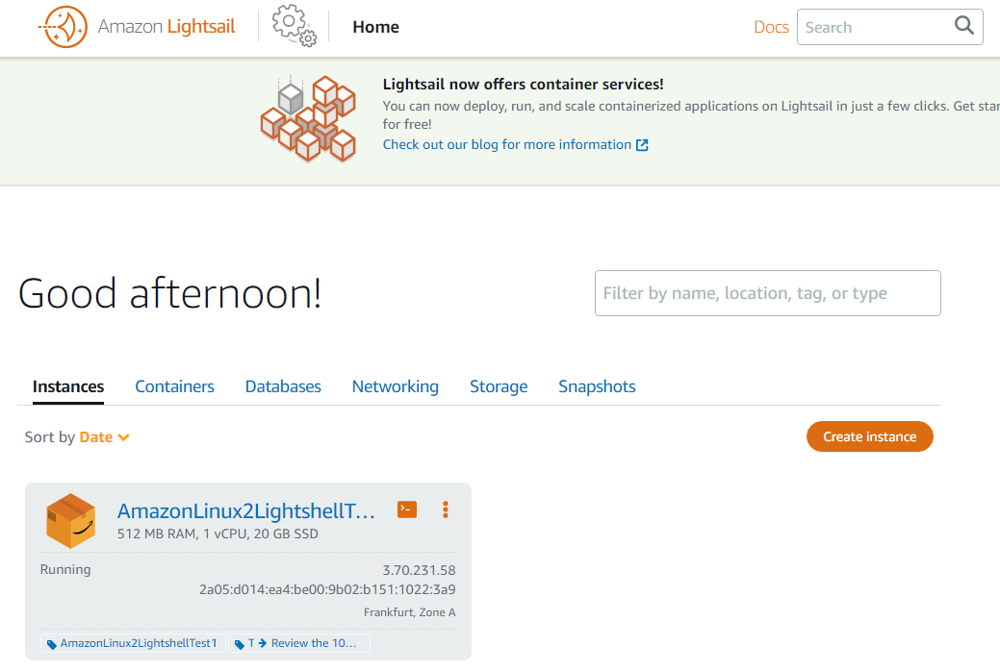
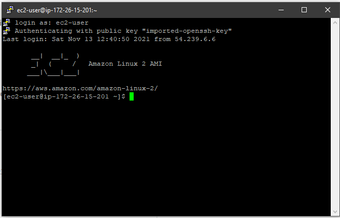
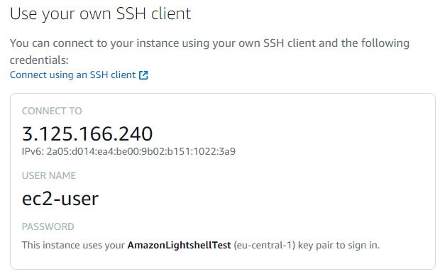
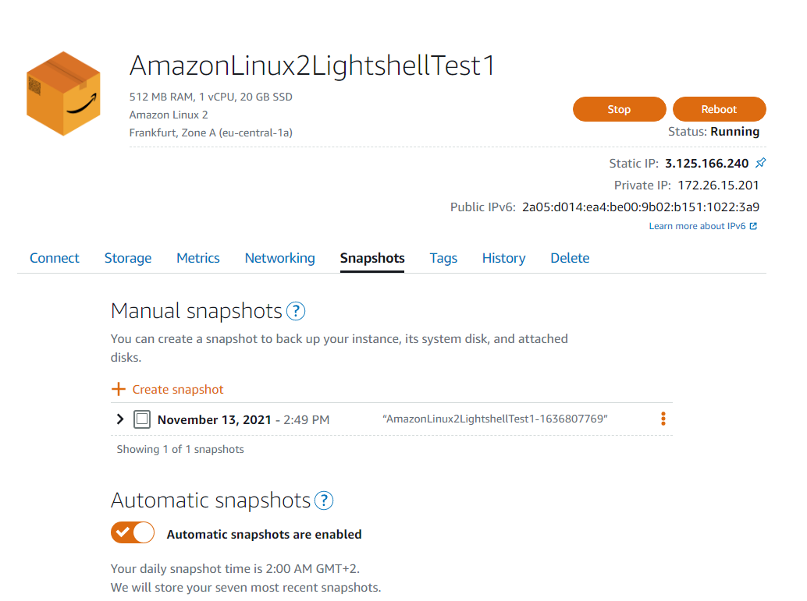
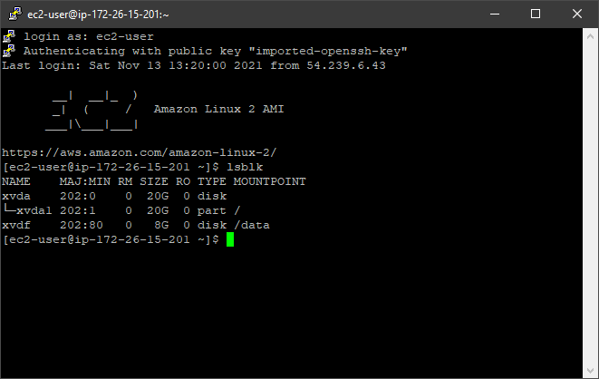

# Task 2.2
> Amazon Web Services

## 1. Read the terms of Using the AWS Free Tier and the ability to control their own costs.
> I have read about 12-month limitations, hourly usage tarification, AWS Budgets and billing.

## 2. Register with AWS (first priority) or alternatively, you can register with AWS Educate if you are currently a student.
> I have registered new aws account.

## 3. Find the hands-on tutorials and AWS Well-Architected Labs for your AWS needs. Explore list of step-by-step tutorials for deferent category. Use, repeat and have fun))
> on my way

## 4. Review the 10-minute example Launch a Linux Virtual Machine with Amazon Lightsail. Repeat, create your own VM in the AWS cloud and connect to it.

>

## 5. Launch another Linux Virtual Machine without Amazon Lightsail. It is recommended to use the t2 or t3.micro instance and the CentOS operating system.
>