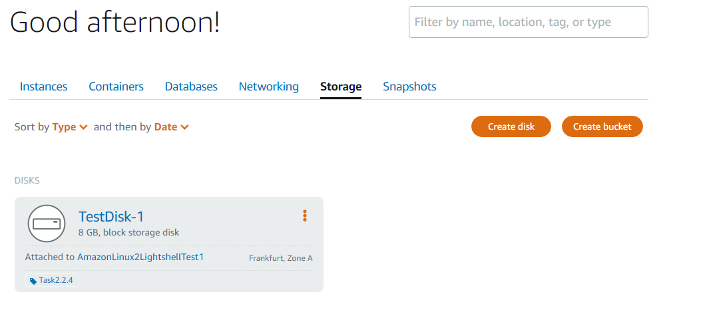
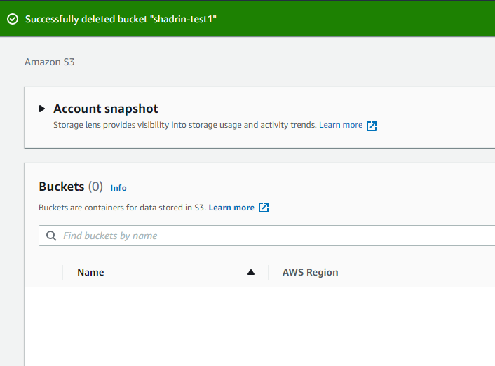
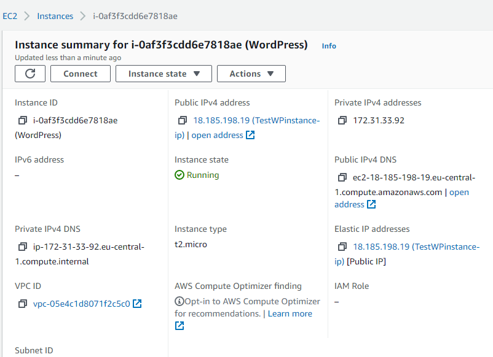

# Task 2.2
> Amazon Web Services

## 1. Read the terms of Using the AWS Free Tier and the ability to control their own costs.
> I have read about 12-month limitations, hourly usage tarification, AWS Budgets and billing.

## 2. Register with AWS (first priority) or alternatively, you can register with AWS Educate if you are currently a student.
> I have registered new aws account.

## 3. Find the hands-on tutorials and AWS Well-Architected Labs for your AWS needs. Explore list of step-by-step tutorials for deferent category. Use, repeat and have fun))
> on my way

## 4. Review the 10-minute example Launch a Linux Virtual Machine with Amazon Lightsail. Repeat, create your own VM in the AWS cloud and connect to it.

>

## 5. Launch another Linux Virtual Machine without Amazon Lightsail. It is recommended to use the t2 or t3.micro instance and the CentOS operating system.
>

## 6. Create a snapshot of your instance to keep as a backup.
>

## 7. Create and attach a Disk_D (EBS) to your instance to add more storage space. Create and save some file on Disk_D.
>

## 8. Launch the third instance from backup.
> I have made template from the 3nd instance. Then have launched the 3rd from template

## 9. Detach Disk_D from the 2nd instance and attach disk_D to the new instance.
> I have detached second volume added from template. Then I have attached the detached one from the 2nd instance.

## 10. Launch and configure a WordPress instance with Amazon Lightsail link

##11. Review the 10-minute example Store and Retrieve a File. Repeat, creating your own repository.

##12. Review the 10-minute example Batch upload files to the cloud to Amazon S3 using the AWS CLI. Create a user AWS IAM, configure CLI AWS and upload any files to S3.

##13. Review the 10-minute example. Explore the possibilities of creating your own domain and domain name for your site.

##14. Review the 10-minute example Deploy Docker Containers on Amazon Elastic Container Service (Amazon ECS). Repeat, create a cluster, and run the online demo application or better other application with custom settings.

##15. Create a static website on Amazon S3, publicly available (link1 or link2 - using a custom domain registered with Route 53). Post on the page your own photo, the name of the educational program (EPAM DevOps online Autumn 2021), the list of AWS services with which the student worked within the educational program or earlier and the full list with links of completed labs (based on tutorials or qwiklabs). Provide the link to the website in your report and СV.

My static website on Amazon S3 [shadrin.link](http://shadrin.link/).