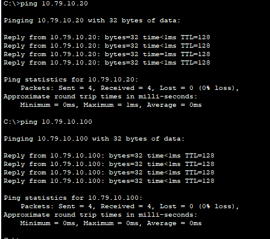
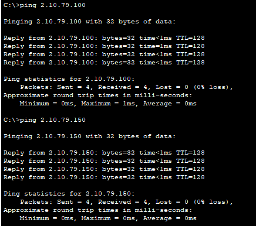
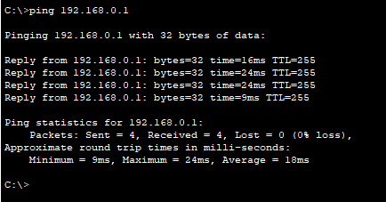
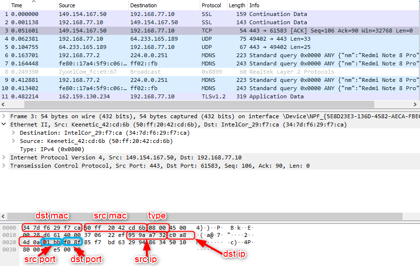

# Task 3.1 Network Fundamentals
> Create Home Office network, Data Center network, Enterprise network.

## 1. Create Home Office network, Data Center network, Enterprise network
> I have created all 3 networks and I have checker if they working:

## 2. Using Wireshark network packet analyser
> I have made tcp-dump and I have made all tasks:

