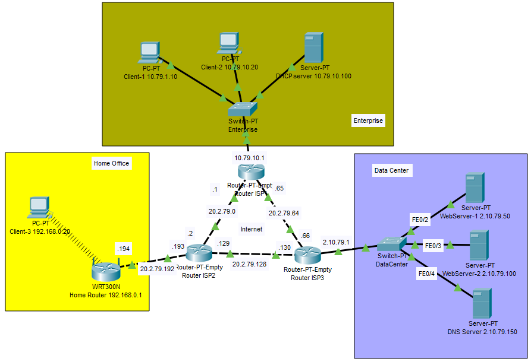
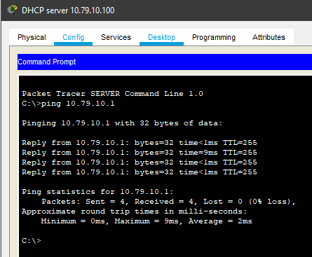
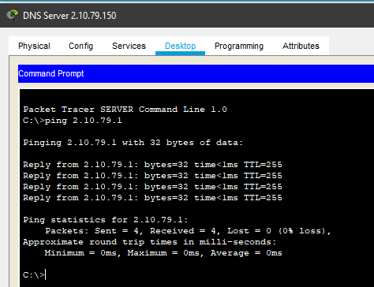
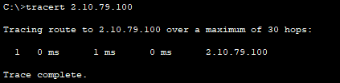
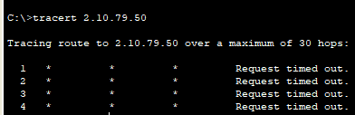
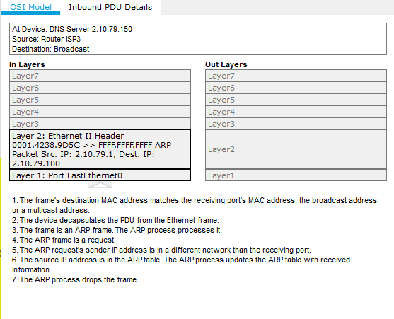
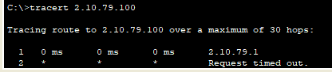
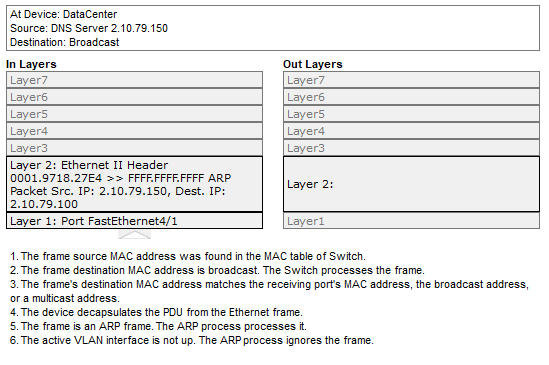
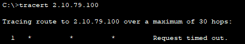

# Task 3.2 Network Fundamentals
> Connect local networks using the Internet and make VLAN settings.

## 1. Connecting local networks using the Internet
> See screenshots:

## 2. VLAN settings in the Data Center
> Check the connection between the servers using the ping command and the route of the packet using the tracert with the mask 255.255.255.0
> For all 3 servers we have 1 hop:
> The ICMP packet sent by the tracert retrieves the destination IP from the switch's ARP table and then goes directly to the destination.

> Check the connection between the servers using the ping command and the route of the packet using the tracert with the mask 255.255.255.192
> Subnet mask 255.255.255.192 makes all 3 servers with ip .50 .100 and .150 isolated in differenst subnets.
> So ARP drops packets from enother networks:

> except ip .50 because the Router have the same subnet ip .1 and we can see 1 hop to destination:

> Create 3 VLANS and tracert enother server. Because all 3 servers are in separated vlans we can see:

## 3. VLAN settings in the Data Center. Additional task with CLI