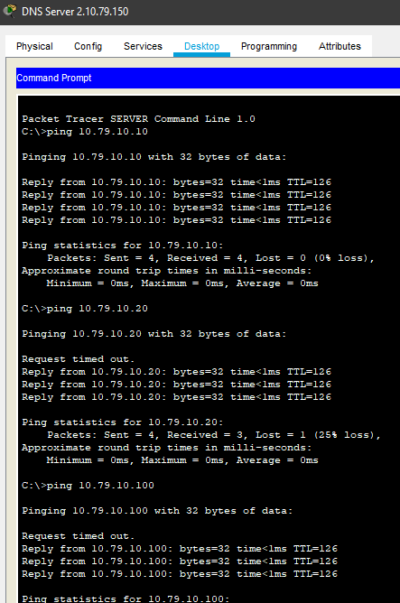
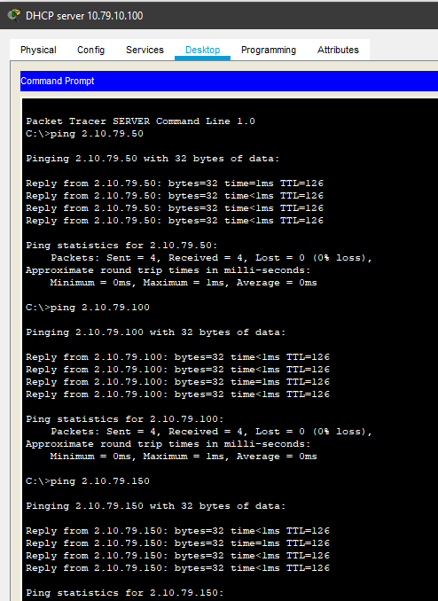
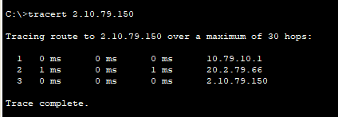
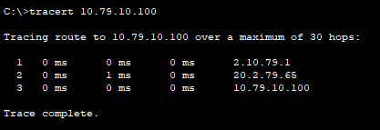
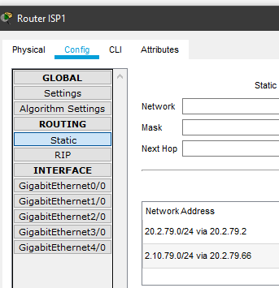
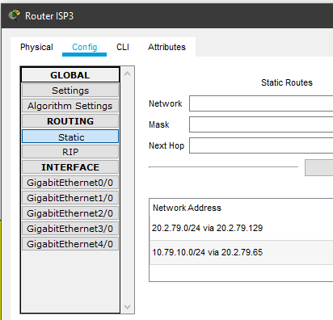
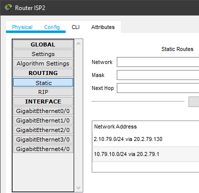

# Task 3.3 Routing
> Connect local networks using the Internet and make VLAN settings.

## 1. Setting up static routing
> See screenshots of ping and trecert commans:

## 2. Setting up dynamic routing using RIP protocol

> See screenshots of ping and trecert commans:

