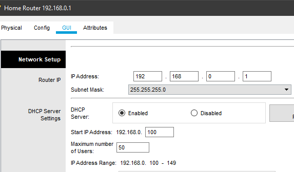

# Task 3.4 DHCP and DNS
> Set up DNS and DHCP servers.

## 1. Setting up DHCP servers
> Enterprise DHCP server:

> Home office DHCP server:

## 2. Setting up dynamic routing using RIP protocol
> Setting up DNS-server in Datacenter:

> Setting up DNS-server at home office:

> Checking DNS on home and enterprise clients:

