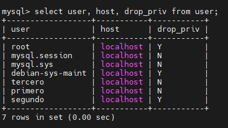
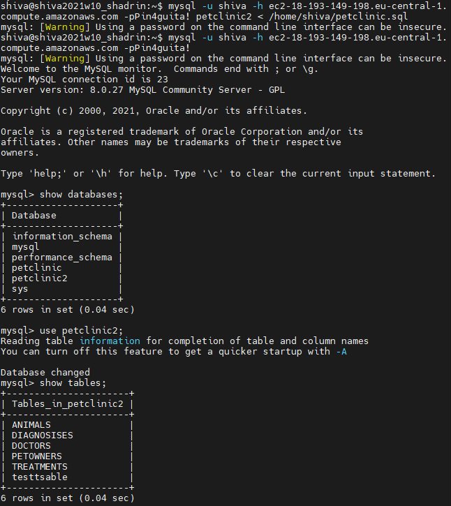

# Task 4.1 Module 3 Database Administration
> 

## 1. PART 1
> 1. Download MySQL server for your OS on VM.
> 2. Install MySQL server on VM.
I have instaled MySQL on Ubuntu 18  Vbox-instance
~$sudo apt install mysql-server

> Some User management:

> 3. Select a subject area and describe the database schema, (minimum 3 tables)

PetClinic
Tables:
Animals
PetOwners
Doctors
Diagnosises
Treatments

> 4. Create a database on the server through the console.
mysql -u root -p
CREATE DATABASE petclinic;
USE petclinic;

> 5. The database is created and filled with a script:

> 6. Construct and execute SELECT operator with WHERE, GROUP BY and ORDER BY.

> 8. Create a database of new users with different privileges. Connect to the database as a new user and verify that the privileges allow or deny certain actions.

mysql -u root -p

ALTER USER 'root'@'localhost' IDENTIFIED WITH mysql_native_password BY 'Passwd12345';

> User primero have rights to create tables and modify/add columns.

CREATE USER 'primero'@'localhost' IDENTIFIED WITH mysql_native_password BY 'Passwd111';

GRANT CREATE, ALTER on *.* TO 'primero'@'localhost' WITH GRANT OPTION;

> User segundo have rights to delete some data from tables, delete tables and view info.

CREATE USER 'segundo'@'localhost' IDENTIFIED WITH mysql_native_password BY 'Passwd222';

GRANT DROP, DELETE, SELECT on *.* TO 'segundo'@'localhost' WITH GRANT OPTION;

> User tercero have only viewing rights.

CREATE USER 'tercero'@'localhost' IDENTIFIED WITH mysql_native_password BY 'Passwd333';

GRANT SELECT on *.* TO 'tercero'@'localhost' WITH GRANT OPTION;

FLUSH PRIVILEGES;

quit

> 9. Make a selection from the main table DB MySQL.

mysql -u root -p

use mysql;

show tables;

## 2. PART 2

>10.Make backup of your database.

mysqldump -u root -p petclinic > /home/shiva/petclinic.sql

>11.Delete the table and/or part of the data in the table.

>12.Restore your database.

mysql -u root -p petclinic < /home/shiva/petclinic.sql

>13.Transfer your local database to RDS AWS.

I have created Centos7 EC2 instance. Security group have opened 3306 port to connect mysql.

14.Connect to your database.

mysql -u shiva -h ec2-18-193-149-198.eu-central-1.compute.amazonaws.com -pPASSWORD

15.Execute SELECT operator similar step 6.
16.Create the dump of your database.

mysql -u shiva -h ec2-18-193-149-198.eu-central-1.compute.amazonaws.com -pPin4guita! petclinic2 > /home/shiva/petclinic2.sql

## 3. PART 3

17.Create an Amazon DynamoDB table

18.Enter data into an Amazon DynamoDB table.

19.Query an Amazon DynamoDB table using Query and Scan.