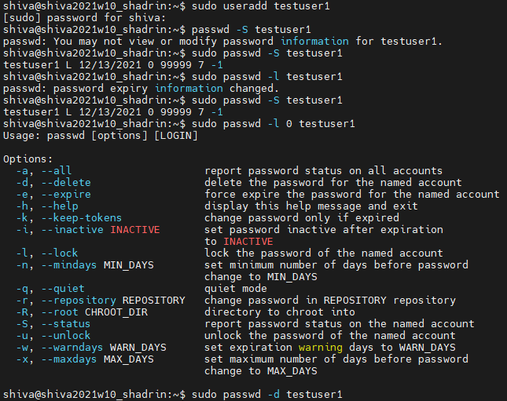
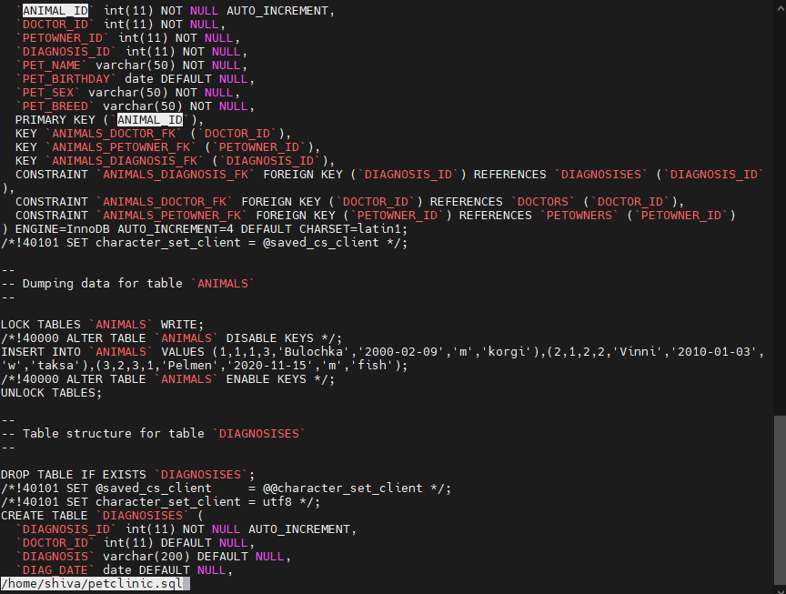
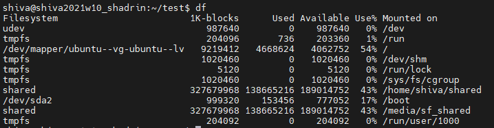

# Task 5.1 Module 5 Linux Essential

## 1. PART 1
>1) Log in to the system as root.
> sudo su

>2) Use the passwd command to change the password. Examine the basic parameters of the command. What system file does it change *?
>passwd <options> user
>options
-d delete user password
-l restrict access to user
-x user password expires in xxx days
-S user account information

users list we can find in /etc/passwd
encrypted passwords are in /etc/shadow

>3) Determine the users registered in the system, as well as what commands they execute. What additional information can be gleaned from the command execution?

cat /etc/passwd

The /etc/passwd file is a colon-separated file that contains the following information:
User name
Encrypted password
User ID number (UID)
User's group ID number (GID)
Full name of the user (GECOS)
User home directory
Login shell

>4) Change personal information about yourself.

>5) Become familiar with the Linux help system and the man and info commands. Get help on the previously discussed commands, define and describe any two keys for these commands. Give examples.

man ls
    Display the manual page for the item (program) ls.

-f
	equivalent to whatis
-i, --ignore-case
	look for pages case-insensitively (default)

>6) Explore the more and less commands using the help system. View the contents of files .bash* using commands.

The less command lets you page through a text file, displaying a screenful of text each time.

less -p ANIMAL_ID /home/shiva/petclinic.sql

more /home/shiva/petclinic.sql

One of the reasons why less was introduced was to allow backward movement line by line. It has a lot of commands that are similar to the vi text editor’s commands, and it supports horizontal scrolling, live monitoring, and more.

less has support for different file formats. For example, if we try to read a png, jpeg, or jpg file with more, it would just print its binary data, whereas less would print its metadata.
less supports other file formats such as jar, war, zip, pdf, tar.gz, gif, png, tiff, tif, and rar.

>7) * Describe in plans that you are working on laboratory work 1. Tip: You should read the documentation for the finger command.

>sudo apt install finger
>man finger

>8) * List the contents of the home directory using the ls command, define its files and directories. Hint: Use the help system to familiarize yourself with the ls command.

>ls -al

-a option shows all directories and files
-l option shows all as one list with columns

## 2. PART 2

>1) Examine the tree command. Master the technique of applying a template, for example, display all files that contain a character c, or files that contain a specific sequence of characters. List subdirectories of the root directory up to and including the second nesting level.

>sudo apt  install tree
>sudo tree -aL 2 -P '*sql

>2) What command can be used to determine the type of file (for example, text or binary)? Give an example.
> file petclinic.sql

>3) Master the skills of navigating the file system using relative and absolute paths. How can you go back to your home directory from anywhere in the filesystem?

>4) Become familiar with the various options for the ls command. Give examples of listing directories using different keys. Explain the information displayed on the terminal using the -l and -a switches.

I have used 'ls -al' in p8 of Part 1 

>5) Perform the following sequence of operations: - create a subdirectory in the home directory; - in this subdirectory create a file containing information about directories located in the root directory (using I/O redirection operations);

mkdir task5.1_2.5
tree -dL 1 > task5.1_2.5/roottree.txt

>- view the created file;

>- copy the created file to your home directory using relative and absolute addressing.

>- delete the previously created subdirectory with the file requesting removal;

>- delete the file copied to the home directory.

rm -rI task5.1_2.5/
rm roottree1.txt roottree2.txt

>6) Perform the following sequence of operations:
>- create a subdirectory test in the home directory;
mkdir test

>- copy the .bash_history file to this directory while changing its name to labwork2;
cp .bash_history test/labwork2

>- create a hard and soft link to the labwork2 file in the test subdirectory;
ln -P labwork2 hrdlnk_01
ln -s labwork2 sftlnk_01

>- how to define soft and hard link, what do theseconcepts;
A symbolic or soft link is an actual link to the original file, whereas a hard link is a mirror copy of the original file.
If you delete the original file, the soft link has no value, because it points to a non-existent file.

In a nutshell, a soft link
-can cross the file system,
-allows you to link between directories,
-has different inode number and file permissions than original file,
-permissions will not be updated,
-has only the path of the original file, not the contents.

A hard Link
-can't cross the file system boundaries (i.e. A hardlink can only work on the same filesystem),
-can't link directories,
-has the same inode number and permissions of original file,
-permissions will be updated if we change the permissions of source file,
-has the actual contents of original file, so that you still can view the contents, even if the original file moved or removed.

>- change the data by opening a symbolic link. What changes will happen and why

>- rename the hard link file to hard_lnk_labwork2;
mv hrdlnk_01 hrdlnk_02

>- rename the soft link file to symb_lnk_labwork2 file;
mv sftlnk_01 sftlnk_02

>- then delete the labwork2. What changes have occurred and why?

>7) Using the locate utility, find all files that contain the squid and traceroute sequence.

sudo apt install locate

>8) Determine which partitions are mounted in the system, as well as the types of these partitions.

df

>9) Count the number of lines containing a given sequence of characters in a given file.
wc command do that

less hrdlnk_02 | wc -l

>10) Using the find command, find all files in the /etc directory containing the host character sequence.

sudo find -type f -name "*host*"

>11) List all objects in /etc that contain the ss character sequence. How can I duplicate a similar command using a bunch of grep?

sudo find -name "*ss*"
ls -al | grep "ss"

>12) Organize a screen-by-screen print of the contents of the /etc directory. Hint: You must use stream redirection operations.

ls -alh | less

>13) What are the types of devices and how to determine the type of device? Give examples.

All devices in linux are files. They are located in /dev directory.
c - character
These devices transfer data, but one a character at a time. You'll see a lot of pseudo devices (/dev/null) as character devices, these devices aren't really physically connected to the machine, but they allow the operating system greater functionality.

b - block
These devices transfer data, but in large fixed-sized blocks. You'll most commonly see devices that utilize data blocks as block devices, such as harddrives, filesystems, etc.

p - pipe
Named pipes allow two or more processes to communicate with each other, these are similar to character devices, but instead of having output sent to a device, it's sent to another process.

s - socket
Socket devices facilitate communication between processes, similar to pipe devices but they can communicate with many processes at once. 

>14) How to determine the type of file in the system, what types of files are there?

I have described c b p s types above.
More 3 are:
d - directory
- - file
l - link file

Command file helps us to check the type of file

ls -lha /dev | grep ^b
ls -lha /dev | grep ^l

>15) * List the first 5 directory files that were recently accessed in the /etc directory.

ls -ltr | tail -n 5
