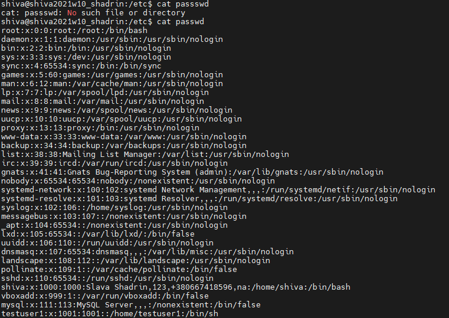
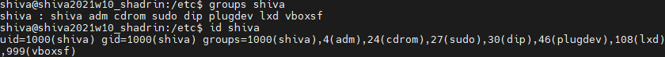
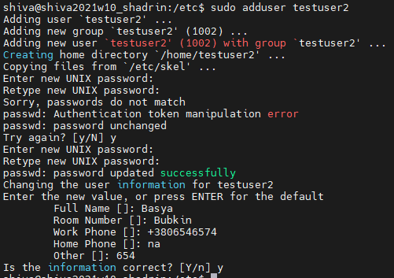
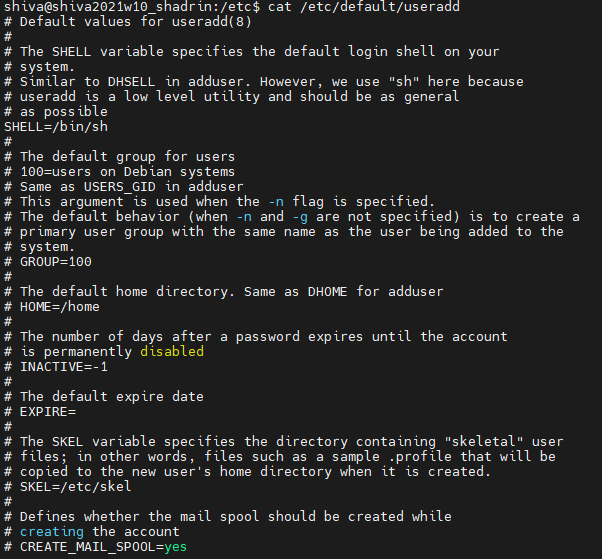
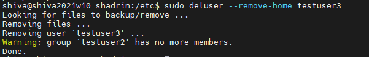
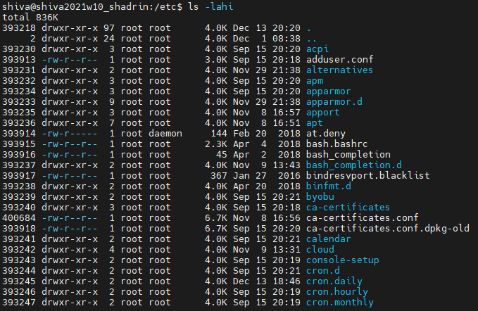
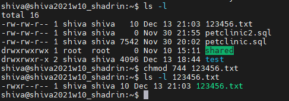
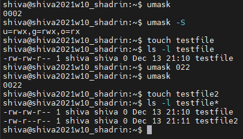

# Task 5.2 Module 5 Linux Essential

>1) Analyze the structure of the /etc/passwd and /etc/group file, what fields are present in it, what users exist on the system? Specify several pseudo-users, how to define them?

The /etc/passwd file is a text-based database of information about users that may log into the system or other operating system user identities that own running processes.
The 7 fields, in order from left to right, are:
1. jsmith: User name: the string a user would type in when logging into the operating system: the logname. Must be unique across users listed in the file.
2. x: Information used to validate a user's password. The format is the same as that of the analogous field in the shadow password file, with the additional convention that setting it to "x" means the actual password is found in the shadow file, a common occurrence on modern systems.
3. 1001: user identifier number, used by the operating system for internal purposes. It need not be unique.
4. 1000: group identifier number, which identifies the primary group of the user; all files that are created by this user may initially be accessible to this group.
5. Joe Smith,Room 1007...: Gecos field, commentary that describes the person or account. Typically, this is a set of comma-separated values including the user's full name and contact details.
6. /home/jsmith: Path to the user's home directory.
7. /bin/sh: Program that is started every time the user logs into the system. For an interactive user, this is usually one of the system's command line interpreters (shells).

1. group_name: It is the name of group. If you run ls -l command, you will see this name printed in the group field.
2. Password: Generally password is not used, hence it is empty/blank. It can store encrypted password. This is useful to implement privileged groups.
3. Group ID (GID): Each user must be assigned a group ID. You can see this number in your /etc/passwd file.
4. Group List: It is a list of user names of users who are members of the group. The user names, must be separated by commas.

Users on Linux and UNIX systems are assigned to one or more groups for the following reasons:

To share files or other resource with a small number of users
Ease of user management
Ease of user monitoring
Group membership is perfect solution for large Linux (UNIX) installation.
Group membership gives you or your user special access to files and directories or devices which are permitted to that group

Pseudo-users accounts created for working with applications such as proxy, syslog.
Pseudo-users have 7s field /usr/sbin/nologin

>2) What are the uid ranges? What is UID? How to define it?
A UID (user identifier) is a number assigned by Linux to each user on the system.
0 - root
65534 - nobody user
1-999 - reserved for system used
1000-65533 can be assigned to users
1000 assigned to first user

>3) What is GID? How to define it?
Groups in Linux are defined by GIDs (group IDs).
Just like with UIDs, the first 100 GIDs are usually reserved for system use.
The GID of 0 corresponds to the root group and the GID of 100 usually represents the users group.
GIDs are stored in the /etc/groups file

>4) How to determine belonging of user to the specific group?

groups user
id user

>5) What are the commands for adding a user to the system? What are the basic parameters required to create a user?

sudo adduser UserLogin

>6) How do I change the name (account name) of an existing user?

sudo usermod -l NewUsername OldUserName

Also with usermod command we can:
Add a User to a Group	usermod -a -G GROUP USER
Change User Primary Group 	sudo usermod -g GROUP USER
Change a User Home Directory	usermod -d HOME_DIR USER
Change a User Default Shell	usermod -s SHELL USER
Changa a User UID	usermod -u UID USER

>7) What is skell_dir? What is its structure?
/etc/skel - its skeleton directory with template for new user
Structure of skeldir is defined in /etc/default/useradd

>8) How to remove a user from the system (including his mailbox)?

sudo deluser --remove-home <user>

>9) What commands and keys should be used to lock and unlock a user account?

sudo passwd -l <user>
sudo passwd -u <user>

>10) How to remove a user's password and provide him with a password-free login for subsequent password change?

sudo passwd -de <user>

>11) Display the extended format of information about the directory, tell about the information columns displayed on the terminal.
1 inode index
2 access rights3
3 count links to file/directory
4 owner UID
5 owner GID
6 size
7 last modified
8 name

>12) What access rights exist and for whom (i. e., describe the main roles)? Briefly describe the acronym for access rights.
There are 3 sets of rights.
xxx yyy zzz
owner group other
Every set have sequence
w = 2 - write/modify
r = 4 - read
x = 1 - execute
0 = nothing
Sequence can be represented by 1byte sum of rights 0-7:
wrx = 7
rw = 6
rx = 5

>13) What is the sequence of defining the relationship between the file and the user?

The first character of a long listing is filesystem object. 
Code	Object type
–	Regular file
d	Directory
l	Symbolic link
c	Character special device
b	Block special device
p	FIFO
s	Socket

Then 9 symbols: owner group other

>14) What commands are used to change the owner of a file (directory), as well as the mode of access to the file? Give examples, demonstrate on the terminal.

chown new-owner  filename(directoryname) <- change owner command
chmod 755 file <- change access rights

>15) What is an example of octal representation of access rights? Describe the umask command.

Partially described in 12)

>16) Give definitions of sticky bits and mechanism of identifier substitution. Give an example of files and directories with these attributes.

In computing, the sticky bit is a user ownership access right flag that can be assigned to files and directories on Unix-like systems.
There are two definitions: one for files, one for directories.
For files, particularly executables, superuser could tag these as to be retained in main memory, even when their need ends, to minimize swapping that would occur when another need arises, and the file now has to be reloaded from relatively slow secondary memory. This function has become obsolete due to swapping optimization.

The sticky bit can be set using the chmod command and can be set using its octal mode 1000 or by its symbol t (s is already used by the setuid bit). For example, to add the bit on the directory /usr/local/tmp, one would type chmod +t /usr/local/tmp. Or, to make sure that directory has standard tmp permissions, one could also type chmod 1777 /usr/local/tmp.
In Unix symbolic file system permission notation, the sticky bit is represented by the letter t in the final character-place.
If the sticky-bit is set on a file or directory without the execution bit set for the others category (non-user-owner and non-group-owner), it is indicated with a capital T (replacing what would otherwise be -)

>17) What file attributes should be present in the command script?

Attributes in Linux
Some filesystems support additional attributes (other than those described in the preceding sections).
In particular, some Linux-native filesystems support several attributes that you can adjust with the chattr command.
The files and directories can have following attributes:

a - append only
c - compressed
d - no dump
e - extent format
i - immutable
j - data journaling
s - secure deletion
t - no tail-merging
u - undeletable
A - no atime updates
D - synchronous directory updates
S - synchronous updates
T - top of directory hierarchy

for command scripts must be present 'x' attribute - execution.

for listing attributes we can use lsattr command