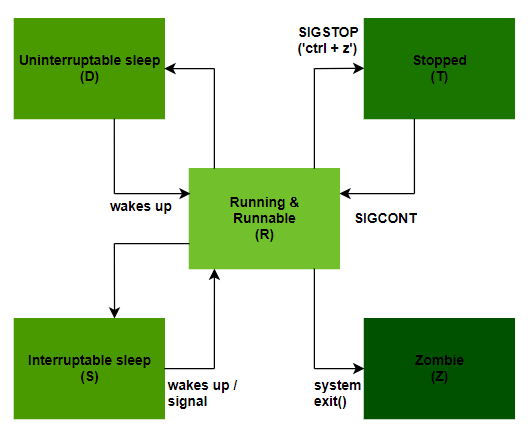
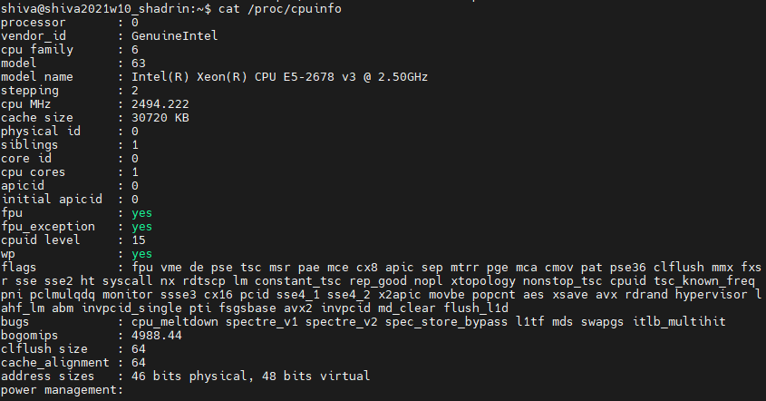
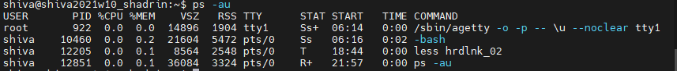

# Task 5.3 Module 5 Linux Essential

## 1. PART 1
1. How many states could has a process in Linux?

In Unix/Linux operating systems, processes can be in one of the following states:
1. RUNNING & RUNNABLE
2. INTERRRUPTABLE_SLEEP
3. UNINTERRUPTABLE_SLEEP
4. STOPPED
5. ZOMBIE

2. Examine the pstree command. Make output (highlight) the chain (ancestors) of the current process.

pstree -h

3. What is a proc file system?

Proc file system (procfs) is virtual file system created on fly when system boots and is dissolved at time of system shut down.
It contains useful information about the processes that are currently running, it is regarded as control and information center for kernel.
The proc file system also provides communication medium between kernel space and user space.

As of 2021, the Linux implementation includes a directory for each running process, including kernel processes, in directories named /proc/PID, where PID is the process number. Each directory contains information about one process, including:
/proc/PID/cmdline, the command that originally started the process.
/proc/PID/cwd, a symlink to the current working directory of the process.
/proc/PID/environ contains the names and values of the environment variables that affect the process.
/proc/PID/exe, a symlink to the original executable file, if it still exists (a process may continue running after its original executable has been deleted or replaced).
/proc/PID/fd, a directory containing a symbolic link for each open file descriptor.
/proc/PID/fdinfo, a directory containing entries which describe the position and flags for each open file descriptor.
/proc/PID/maps, a text file containing information about mapped files and blocks (like heap and stack).
/proc/PID/mem, a binary image representing the process's virtual memory, can only be accessed by a ptrace'ing process.
/proc/PID/root, a symlink to the root path as seen by the process. For most processes this will be a link to / unless the process is running in a chroot jail.
/proc/PID/status contains basic information about a process including its run state and memory usage.
/proc/PID/task, a directory containing hard links to any tasks that have been started by this (i.e.: the parent) process.
(Users may obtain the PID with a utility such as ***pgrep, pidof or ps***:

4. Print information about the processor (its type, supported technologies, etc.).

5. Use the ps command to get information about the process. The information should be as follows: the owner of the process, the arguments with which the process was launched for execution, the group owner of this process, etc.

ps -au

6. How to define kernel processes and user processes?

7. Print the list of processes to the terminal. Briefly describe the statuses of the processes. What condition are they in, or can they be arriving in?

8. Display only the processes of a specific user. 9. What utilities can be used to analyze existing running tasks (by analyzing the help for the ps command)?

10. What information does top command display?
12. Display the processes of the specific user using the top command.
12. What interactive commands can be used to control the top command? Give a couple of examples. 13. Sort the contents of the processes window using various parameters (for example, the amount of processor time taken up, etc.)
14. Concept of priority, what commands are used to set priority?
15. Can I change the priority of a process using the top command? If so, how? 16. Examine the kill command. How to send with the kill command
process control signal? Give an example of commonly used signals.
17. Commands jobs, fg, bg, nohup. What are they for? Use the sleep, yes command to demonstrate the process control mechanism with fg, bg.

## 2. PART 2

1. Check the implementability of the most frequently used OPENSSH commands in the MS Windows operating system. (Description of the expected result of the commands + screenshots: command – result should be presented)
2. Implement basic SSH settings to increase the security of the client-server connection (at least 3. List the options for choosing keys for encryption in SSH. Implement 3 of them.
4. Implement port forwarding for the SSH client from the host machine to the guest Linux virtual machine behind NAT.
5*. Intercept (capture) traffic (tcpdump, wireshark) while authorizing the remote client on the server using ssh, telnet, rlogin. Analyze the result.