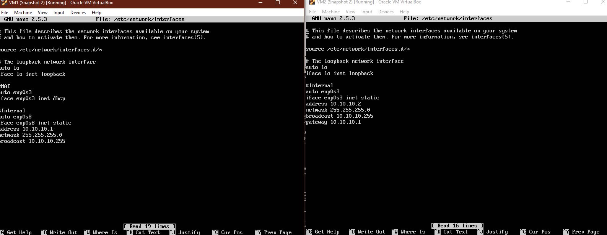
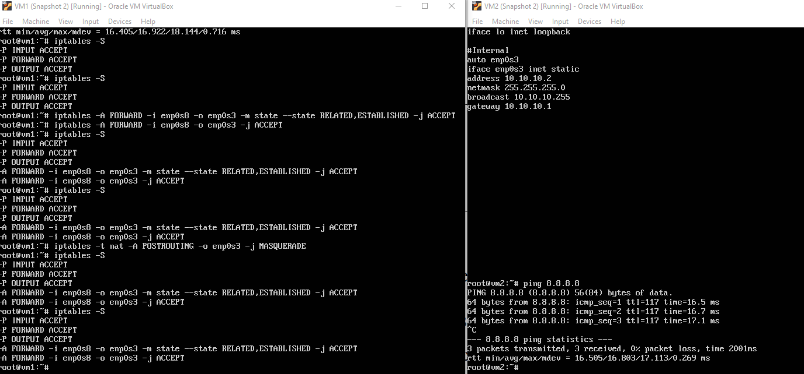
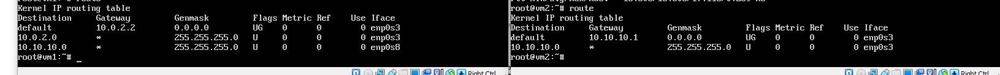
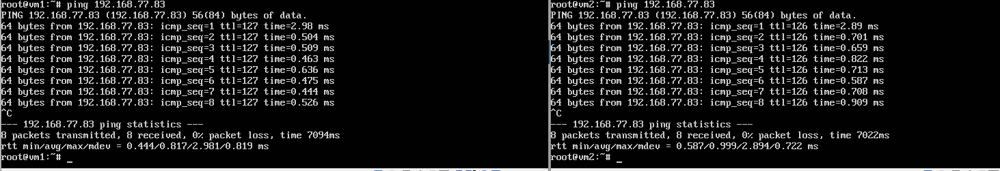
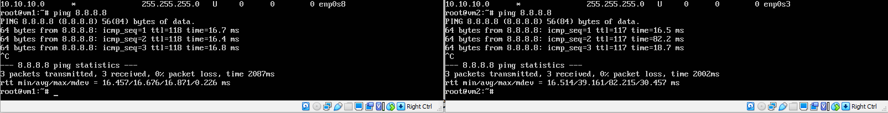
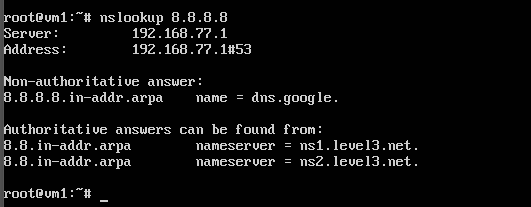
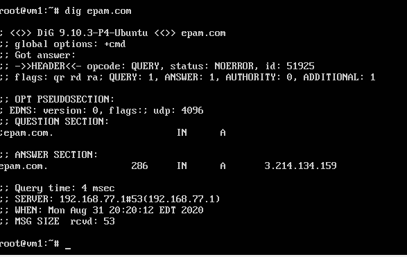
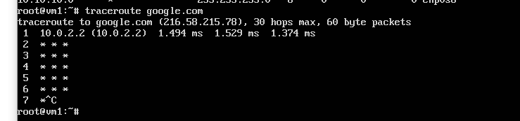

# Task 6.a1
> Linux. IP routing.

## 6.1a.1. Create virtual machines connection according to figure 1.

## 6.1a.2. VM2 has one interface (internal), VM1 has 2 interfaces (NAT and internal).
> Configure all network interfaces in order to make VM2 has an access to the Internet (iptables, forward, masquerade).

## 6.1a.3. Check the route from VM2 to Host.

## 6.1a.4. Check the access to the Internet, (just ping, for example, 8.8.8.8).

## 6.1a.5. Determine, which resource has an IP address 8.8.8.8.
> nslookup 8.8.8.8

> host 8.8.8.8

## 6.1a.6. Determine, which IP address belongs to resource epam.com.
> dig epam.com

## 6.1a.7. Determine the default gateway for your HOST and display routing table.

## 6.1a.8. Trace the route to google.com.

