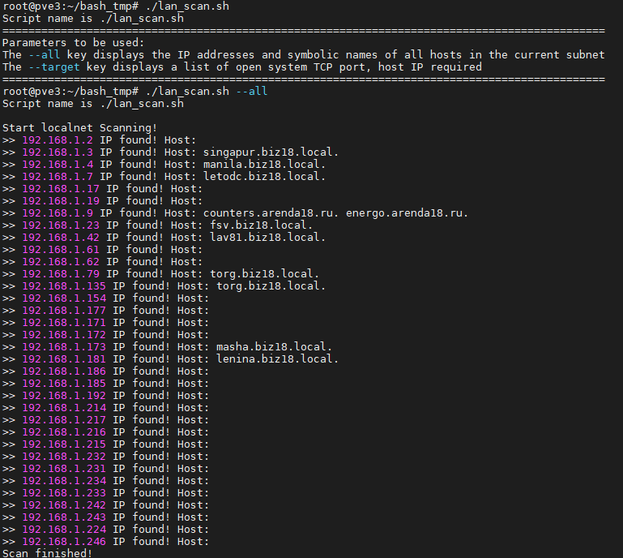
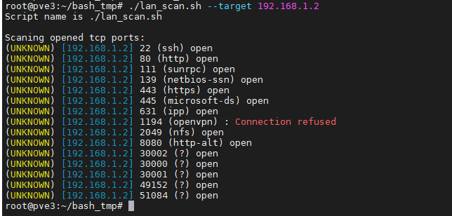
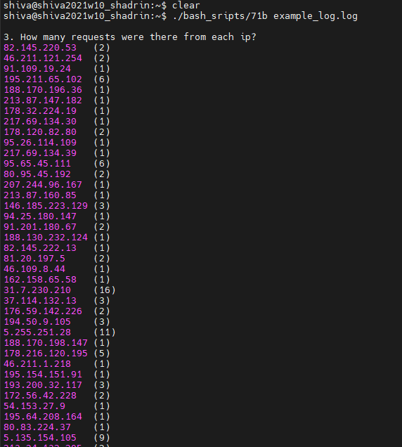
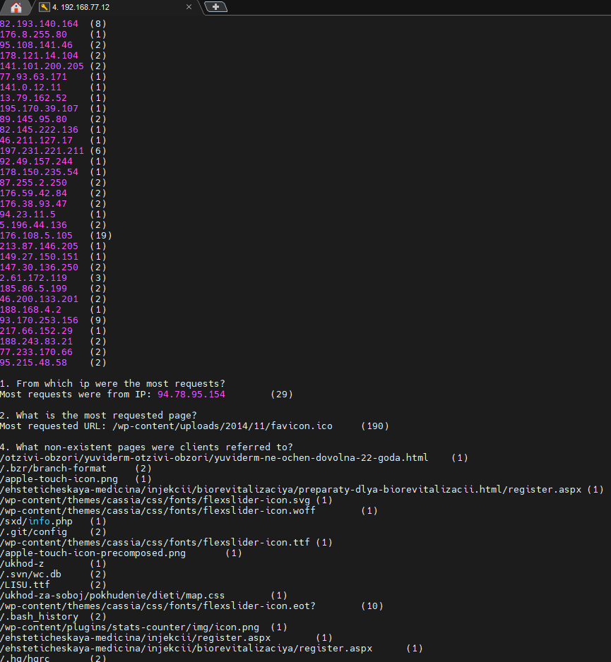
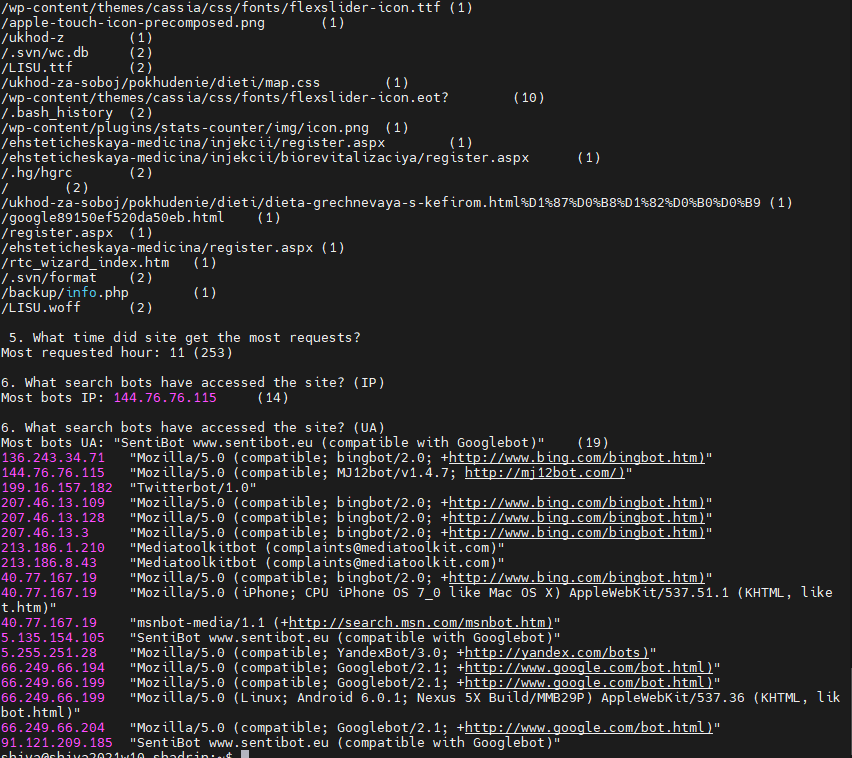
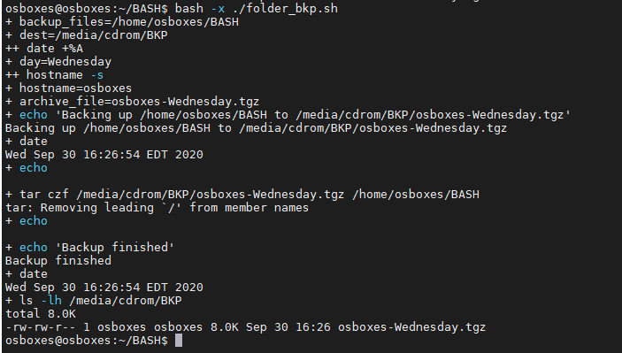

# Task 7.1 Linux administration with bash. Home task

## A. Create a script that uses the following keys:

### 1. When starting without parameters, it will display a list of possible keys and their description.
### 2. The --all key displays the IP addresses and symbolic names of all hosts in the current subnet.
### 3. The --target key displays a list of open system TCP ports..

> The code that performs the functionality of each of the subtasks must be placed in a separate function

## B. Using Apache log example create a script to answer the following questions:

We will use AWK-script to analise log

Web-server access.log structure:
%h %l %u %t \"%r\" %>s %b \"%{Referer}i\" \"%{User-Agent}i\"
%h — хост/IP-адрес, с которого произведён запрос к серверу;
%t — время запроса к серверу и часовой пояс сервера;
%r — тип запроса, его содержимое и версия;
%s — код состояния HTTP;
%b — количество отданных сервером байт;
%{Referer} — URL-источник запроса;
%{User-Agent} — HTTP-заголовок, содержащий информацию о запросе (клиентское приложение, язык и т. д.);
%{Host} — имя Virtual Host, к которому идет обращение.
We have 9 parameters(fields) to analise

### 1. From which ip were the most requests?
we can use command to find all uniq strings, sort them, and show only 1 must requested
>awk '{ print $1}' apache_logs.txt | sort | uniq -c | sort -nr | head -n 1

### 2. What is the most requested page?
we can use command
>awk '{ print $7}' apache_logs.txt | sort | uniq -c | sort -nr | tail -n 1

### 3. How many requests were there from each ip?
we can use command to output 
>awk '{ print $1}' apache_logs.txt | sort | uniq -c | sort -nr

### 4. What non-existent pages were clients referred to?
we can use command
>cat apache_logs.txt | grep error404 -B 1 | awk '{print $7}'

### 5. What time did site get the most requests?
cat apache_logs.txt | awk '($9 ~ /404/)' | awk '{ print $7 }' | sort | uniq -c | sort -rn | head -n 1

### 6. What search bots have accessed the site? (UA + IP)

## C. Create a data backup script that takes the following data as parameters:
### 1. Path to the syncing directory.
### 2. The path to the directory where the copies of the files will be stored.

> In case of adding new or deleting old files, the script must add a corresponding entry to the log file indicating the time, type of operation and file name. [The command to run the script must be added to crontab with a run frequency of one minute]