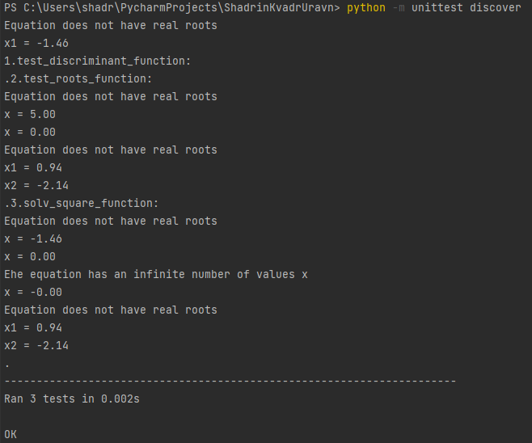
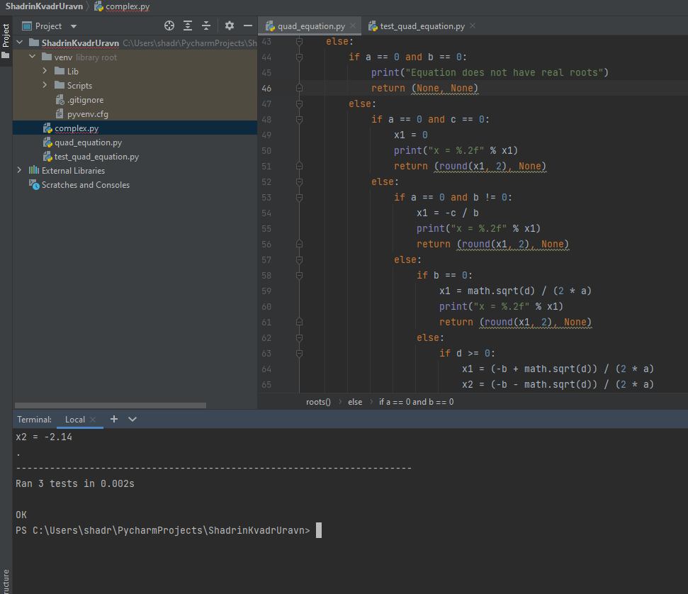
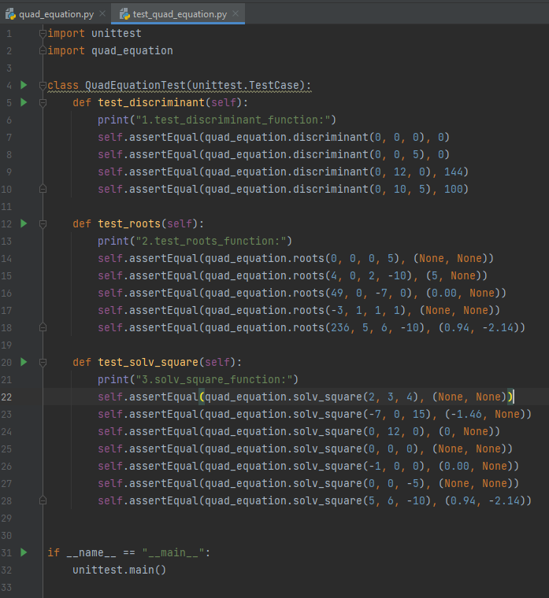

# Task 8.1 Python

## Create Python program that solves quadratic equation of the form 𝑎𝑥􀬶 + 𝑏𝑥 + 𝑐 = 0

> a, b, c - parameters may be setted using input or command line arguments
> In the script, implement several functions that decompose the problem of solving a square equations.
> Parameters must be passed to these functions. Also write UnitTests for these functions.
> functions to be created:
> - main()
> - validate_param(int) - checks that a number is entered and integer, repeats the input 3 times if not a number use exception)
> - discriminant(a, b, c)
> - roots(d, a, b, c)
> - solv_square(a, b, c) -> roots
> - square_print(a, b, c, roots) – displays the result

Python program and UnitTests was created using PyCharm

Program: [quad_equation.py](quad_equation.py)
UnitTests: [test_quad_equation.py](test_quad_equation.py)

Prooves:

